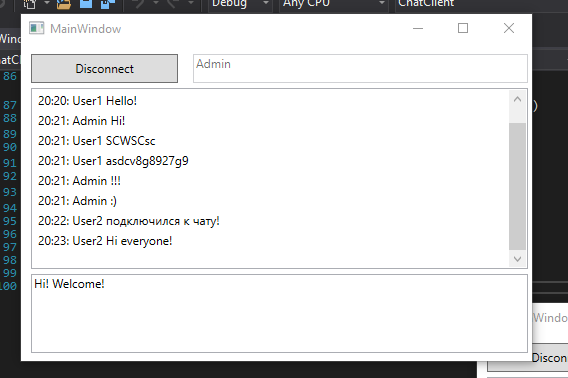

# Chat

Chat on C# (WCF &amp; WPF)

This program is written using .NET Framework.

<h3>Here are examples of how this application works:</h3>

<strong>Chat room is able to have several members:</strong>

